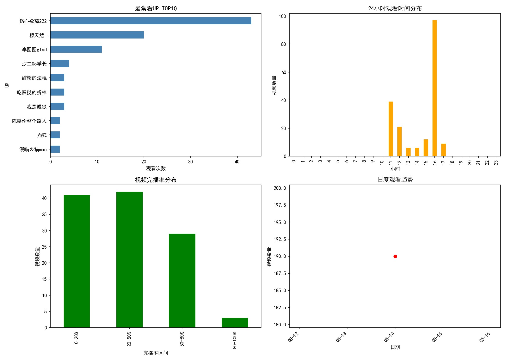

# bilibili-history-analysis
Bilibili Personal Viewing History Data Analysis

独立开发的 B 站个人观看行为数据采集与分析系统。通过分析 B 站 Web API，编写 Python 爬虫获取个人历史观看记录，并利用 Pandas 与 Matplotlib 完成数据清洗、多维度统计与可视化报告生成。

# 功能
- 爬取 B 站个人历史观看记录
- UP 主观看次数排名分析
- 24 小时观看时段分布统计
- 视频完播率分析
- 日度观看趋势可视化

# 技术栈
- Python
- Requests（数据采集）
- Pandas（数据处理）
- Matplotlib（数据可视化）

# 分析结果示例
- 

# 项目结构
- `fetch_history.py` - 数据采集脚本（需配置个人 Cookie）
- `analyze.py` - 数据分析与可视化脚本
- `history_raw.json` - 原始数据（示例）
- `bilibili_analysis.png` - 分析报告图表

# 使用方法
1. 从浏览器获取 B 站 Cookie (SESSDATA)
2. 将 Cookie 填入 `fetch_history.py` 中的对应位置
3. 运行 `python fetch_history.py` 获取数据
4. 运行 `python analyze.py` 生成分析报告
